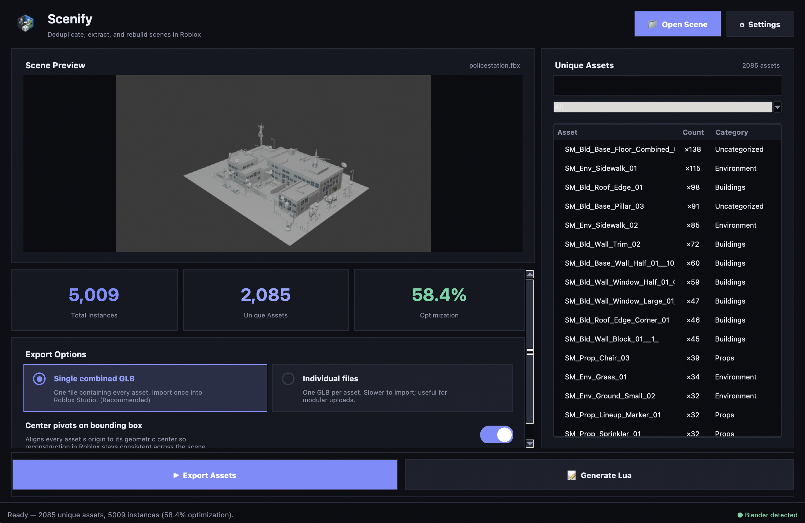

# Scenify

**Deduplicate, extract, and rebuild 3D scenes in Roblox.**

Scenify takes any 3D scene file (FBX, OBJ, GLB, and more), analyzes it with headless Blender to find every unique mesh, exports them as GLB files, and generates Roblox Lua scripts that reconstruct the full scene with correct positions, rotations, and scale — all from a clean desktop GUI.



---

## Features

- **Scene analysis** — headless Blender parses any FBX/OBJ/GLB/DAE/BLEND file and extracts the full instance tree
- **Deduplication** — identifies repeated meshes and exports only unique assets, reducing upload count significantly
- **Live preview** — Blender renders a thumbnail of the loaded scene
- **Two export modes** — single combined GLB (one import into Roblox) or one GLB per asset (modular uploads)
- **Lua generation** — produces a `_reconstruct.lua` script that places every instance by CFrame and a `_runner.lua` entry point
- **Asset browser** — searchable, filterable list of every unique asset with instance count, category, and vertex count

---

## Requirements

| Dependency | Version | Install |
|---|---|---|
| Python | 3.11 (Homebrew) | `brew install python@3.11 python-tk@3.11` |
| Blender | 4.x | [blender.org](https://www.blender.org/download/) — install to `/Applications/Blender.app` |
| Pillow | latest | `pip3.11 install Pillow` |

---

## Quick Start

```bash
cd scene-optimizer
/opt/homebrew/bin/python3.11 main.py
```

---

## Workflow

### 1. Open a Scene File
Click **Open Scene** and select your FBX (or OBJ, GLB, DAE, BLEND, etc.).

Blender runs in the background to analyze the scene — extracting the asset list, instance transforms, and a rendered preview. Takes 1–3 minutes for large scenes.

### 2. Export Assets
Click **Export Assets** after analysis completes.

| Mode | Description |
|------|-------------|
| **Single combined GLB** | All assets in one file — one import into Roblox Studio *(recommended)* |
| **Individual files** | One GLB per asset — useful for modular or selective uploads |

Exported files land in `scene-optimizer/output/`.

### 3. Import into Roblox Studio
- **Single combined GLB** → import `output/assets_combined.glb` via **File → Import → Import 3D**
- **Individual GLBs** → import each file from `output/unique_assets/`

Place the imported model inside `ReplicatedStorage` (or wherever the Lua script expects it).

### 4. Generate Lua
Click **Generate Lua** after export completes.

| File | Purpose |
|------|---------|
| `*_reconstruct.lua` | Places all instances by CFrame — run once to build the scene |
| `*_runner.lua` | Entry point / loader script |
| `scene_data.rbxmx` | Data module with all instance transforms |

Paste `*_runner.lua` into a `Script` in Roblox Studio and run it to reconstruct the scene.

---

## Output Files

```
scene-optimizer/output/
├── assets_combined.glb          # All meshes in one GLB (single mode)
├── unique_assets/               # Per-asset GLBs (individual mode)
├── scene_manifest.json          # Raw scene data from Blender analysis
├── _extraction_results.json     # Export results with per-instance positions
├── scene_data.rbxmx             # Roblox data module
├── DemoScene_reconstruct.lua    # Scene reconstruction script
└── DemoScene_runner.lua         # Loader script
```

---

## Project Structure

```
scene-optimizer/
├── main.py                      # Desktop GUI (tkinter)
├── blender_backend.py           # Headless Blender subprocess orchestration
├── scene_analyzer.py            # Reads manifest, feeds GUI stats
├── lua_generator.py             # Generates Roblox Lua from extraction results
├── _regen_lua.py                # CLI: regenerate Lua without re-extracting
└── blender_scripts/
    ├── analyze_scene.py         # Blender: parse scene → scene_manifest.json
    ├── extract_assets.py        # Blender: export unique meshes as GLB
    ├── render_preview.py        # Blender: render scene thumbnail
    └── compute_bbox_centers.py  # Blender: bounding box center utilities
```

---

## Tips

**Regenerating Lua only** — if you've already extracted assets and only want to tweak the Lua output:
```bash
/opt/homebrew/bin/python3.11 _regen_lua.py
```
Reads `output/_extraction_results.json` and rewrites the Lua files without re-running Blender.

**Custom Blender path** — if Blender is not at `/Applications/Blender.app`, open **Settings** (⚙) in the app to point to its executable, or set the `BLENDER_PATH` environment variable.

---

## Troubleshooting

**Tkinter crashes on launch**
Run with Homebrew Python 3.11 specifically — system Python and Python 3.13 have Tk compatibility issues on macOS.

**Blender not found**
Ensure Blender 4.x is installed at `/Applications/Blender.app`, or configure the path via **Settings**.

**Assets rotated incorrectly**
FBX files from Unreal Engine may have an axis-correction rotation baked into their local transform by Blender's FBX importer. The extractor detects and compensates for this automatically. If an asset still looks wrong, check for a non-Z rotation in its `matrix_local` in Blender.
